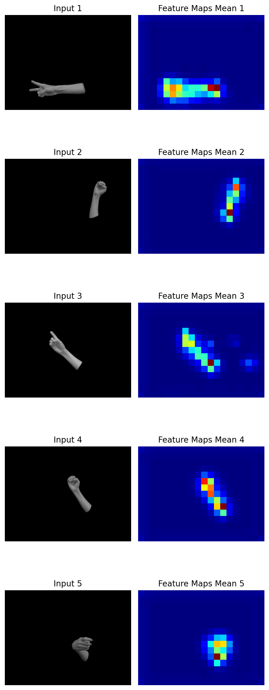
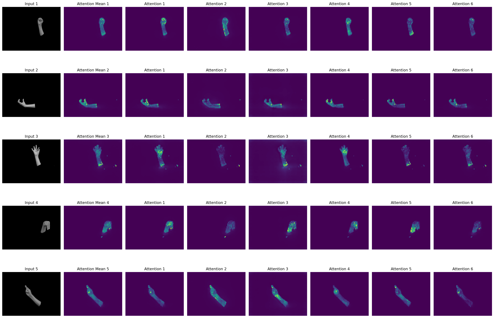
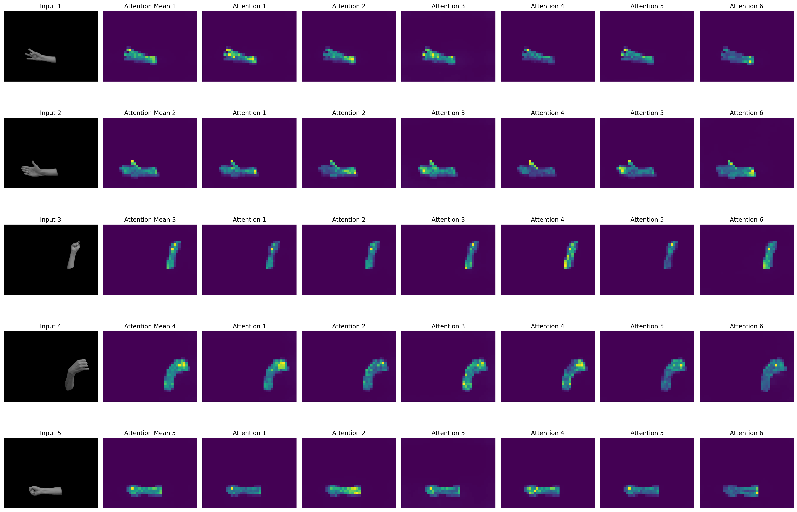
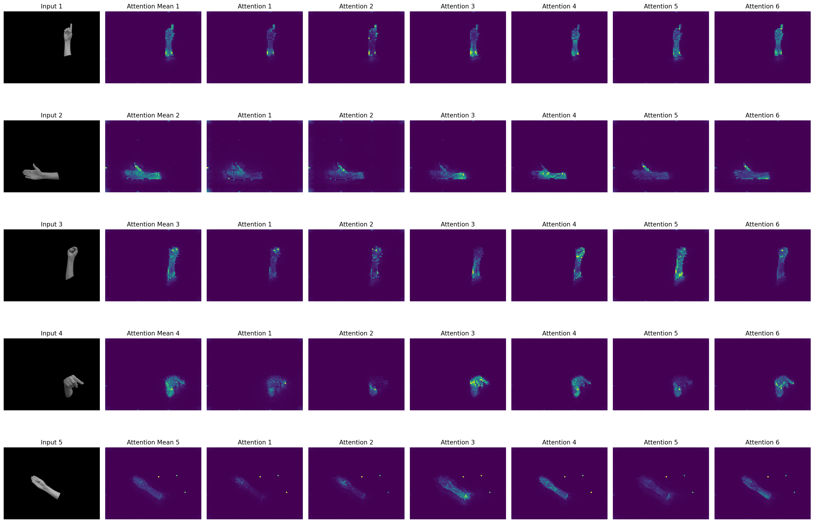
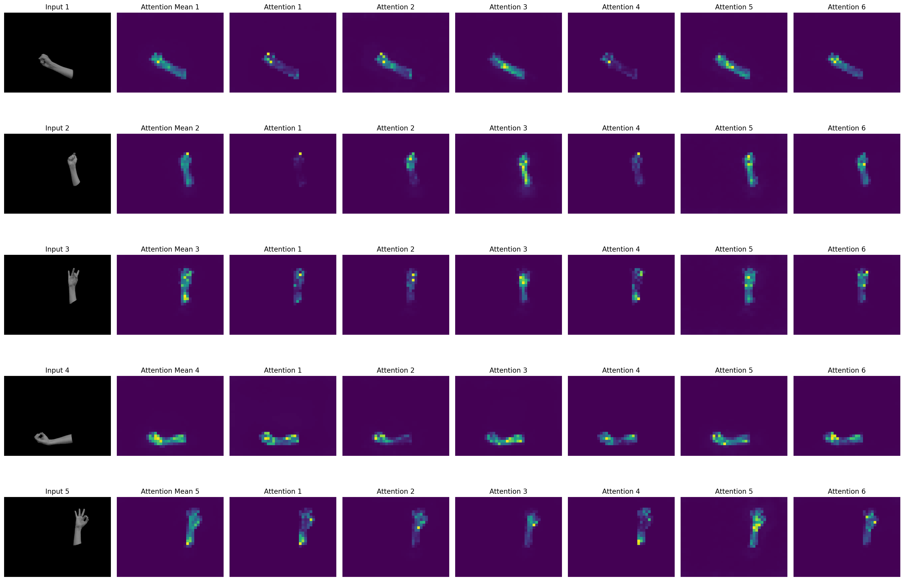

# Exploring Sign Language Recognition with DINO's Self-Attention Mechanism

## Objective:
Enhance the recognition and understanding of micro and macro features of sign language gestures using the self-attention mechanisms of the DINO model.

## Models Utilized:
- **DINO ResNet 50**
- **DINO Small 8x8**
- **DINO Small 16x16**
- **DINO Base 8x8**
- **DINO Base 16x16**

## Dataset:

The dataset used for this project is a **new image dataset for Irish Sign Language (ISL) recognition**, created as part of ongoing work in the field of ISL recognition using pattern recognition methods.

### Key Information about the Dataset:
- **Dataset Name**: Irish Sign Language Recognition Dataset
- **Content**: The dataset consists of 468 videos of human subjects performing ISL hand-shapes and movements. Frames were extracted from these videos, resulting in a total of **58,114 images** representing **23 common hand-shapes** in ISL.
- **Image Format**: The images in the dataset are derived from the extracted frames of the videos.
- **Application**: This dataset is designed for training models to recognize hand gestures in Irish Sign Language, enabling automation of sign language interpretation using computer vision. It is part of ongoing work in ISL recognition using advanced pattern recognition techniques.

You can access the full dataset and further details on [ResearchGate](https://www.researchgate.net/publication/319493254_A_Dataset_for_Irish_Sign_Language_Recognition).

## Approach:
1. **Model Utilization**:  
   Employed the DINO model (5 flavors), designed for self-supervised learning, to focus on learning from visual data without requiring detailed annotations.
   
2. **Attention Mechanism Exploration**:  
   Used the multi-head attention mechanism of the model to analyze specific parts of the hand gestures in sign language.

## Implementation Details:
- **Image Processing**:  
  Transformed images of hand gestures to fit the model’s input requirements, including normalization and resizing to match the model’s patch size.

- **Attention Map Extraction**:  
  Extracted self-attention maps from the model for each image to visualize the focus areas, implemented for multiple heads to capture different features emphasized by each head.

- **Visualization**:  
  Visualized the attention maps to assess the model’s focus areas, using individual attention maps for each head and a combined mean attention map to summarize overall focus areas across heads.

## Results:
- **Focused Attention**:  
  The attention visualizations show the model focusing on relevant features of the sign language gestures, especially around the hand areas.

- **Head Variation**:  
  Visualizations from different attention heads show varying focus points, indicating that the model captures a diverse set of features from the same input, enriching the analysis and understanding of the gestures.

## Model Details

### DINO ResNet-50:
The **DINO ResNet-50** model is a convolutional neural network (CNN)-based architecture designed for self-supervised learning. ResNet-50 uses **convolutions** and **pooling layers** to process images hierarchically, allowing it to detect various features at different levels of abstraction (e.g., edges, textures, and objects).

**Key Characteristics:**
- ResNet-50 excels at extracting hierarchical features but does **not** include an attention mechanism like transformer-based models.
- It generates **feature maps** that represent activations of learned features across spatial regions of the image, though without the explicit focus of attention maps.

  
*DINO ResNet-50 Attention Map*

---

### DINO Small:
The **DINO Small** models (ViT-S/8 and ViT-S/16) demonstrated strong capabilities in focusing on important features in images, particularly around the hand gestures.

**Key Characteristics:**
- **ViT-S/8** (with 8x8 patches) produces more **detailed** attention maps, focusing on finer aspects of the gestures like finger positioning.
- **ViT-S/16** (with 16x16 patches) offers a more **global** view, sacrificing some detail for computational efficiency.
- Both models showed a distributed focus across multiple attention heads, emphasizing different levels of detail and the overall hand structure.

  
*DINO Small 8 Attention Map*

  
*DINO Small 16 Attention Map*

---

### DINO Base:
The **DINO Base** models (ViT-B/8 and ViT-B/16) with larger architectures captured more **refined** and **detailed** spatial features. These models excel at identifying both **fine-grained** and **broader** aspects of hand gestures.

**Key Characteristics:**
- The **DINO Base** models demonstrated sophisticated attention, with **ViT-B/16** capturing larger, coarser features, while **ViT-B/8** zoomed into intricate hand motions.
- These models proved highly suitable for hand gesture recognition tasks, showcasing their ability to differentiate various hand shapes and movements.

  
*DINO Base 8 Attention Map*

  
*DINO Base 16 Attention Map*

---

## Conclusion:
The application of the DINO model’s self-attention mechanism on sign language gesture images successfully highlights critical areas and features, demonstrating the model’s potential to focus on and interpret sign language effectively based solely on visual cues.

